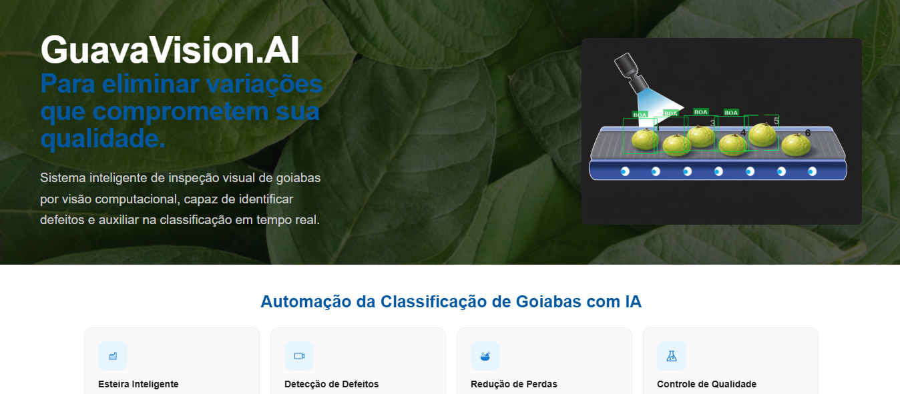
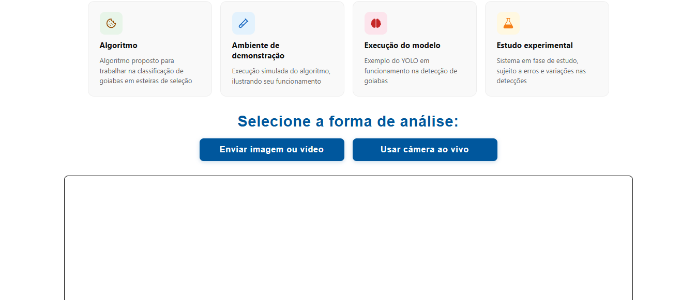

<div align="center">




# GuavaVision.AI

**Demonstração de classificação de goiabas com YOLOv8**

Interface web para visualizar o algoritmo YOLO aplicado à detecção de defeitos em goiabas em tempo real.


</div>

---

> **Aviso:** Este projeto é uma demonstração experimental do algoritmo YOLOv8 aplicado à classificação de goiabas. Os resultados estão sujeitos a variações e erros nas detecções, pois o sistema ainda está em fase de desenvolvimento.

---

## Funcionalidades

- **Detecção via YOLOv8** — identificação de manchas, danos e podridão em goiabas
- **Upload de imagem ou vídeo** — análise a partir de arquivos locais
- **Câmera ao vivo** — processamento em tempo real via webcam
- **Resultados detalhados** — bounding boxes, classes e confiança de cada detecção

---

## Pré-requisitos

- [Python 3.10+](https://www.python.org/)
- [Node.js 18+](https://nodejs.org/)
- [Git](https://git-scm.com/)

---

## Como rodar o projeto

### 1. Clone o repositório

```bash
git clone https://github.com/BiancaCancian/guava-vision.git
cd guava-vision
```

### 2. Backend (FastAPI)

```bash
cd backend

# Crie e ative o ambiente virtual
python -m venv venv

# Windows
venv\Scripts\activate

# Linux / macOS
source venv/bin/activate

# Instale as dependências
pip install -r requirements.txt

# Inicie o servidor
uvicorn main:app --reload
```

Backend disponível em: http://localhost:8000  
Documentação da API: http://localhost:8000/docs

### 3. Frontend (React)

Abra um novo terminal e execute:

```bash
cd frontend
npm install
npm start
```

Frontend disponível em: http://localhost:3000

---

## Dependências

**Backend**
```
fastapi
uvicorn
ultralytics
opencv-python
pillow
python-multipart
websockets
```

**Frontend**
```
react
react-dom
react-router-dom
axios
```

---

## Sobre o projeto


O objetivo é demonstrar a aplicação do algoritmo **YOLOv8** na detecção de defeitos em goiabas em esteiras de seleção, avaliando sua viabilidade para reduzir erros humanos na inspeção visual e aumentar a eficiência operacional na cadeia produtiva.

---
