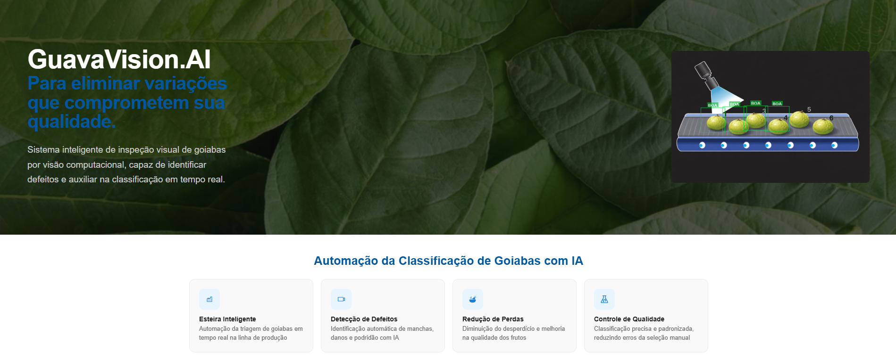

<div align="center">



# 🍃 GuavaVision.AI

**Sistema inteligente de inspeção visual de goiabas por visão computacional**

Detecta defeitos e classifica frutos em tempo real, eliminando variações que comprometem a qualidade.


---

##  Funcionalidades

- 🏭 **Esteira Inteligente** — triagem automatizada em tempo real na linha de produção
- 🔍 **Detecção de Defeitos** — identificação de manchas, danos e podridão com IA (YOLOv8)
- 📷 **Câmera ao Vivo** — análise em tempo real via webcam ou câmera industrial
- 🖼️ **Upload de Imagem/Vídeo** — classificação a partir de arquivos locais
- 📊 **Resultados Detalhados** — bounding boxes, classes e confiança de cada detecção

---

## ⚙️ Pré-requisitos

Antes de começar, certifique-se de ter instalado:

- [Python 3.10+](https://www.python.org/)
- [Node.js 18+](https://nodejs.org/)
- [Git](https://git-scm.com/)

---

## 🚀 Como Rodar o Projeto

### 1. Clone o repositório

```bash
git clone https://github.com/seu-usuario/GuavaVision.AI.git
cd GuavaVision.AI
```

---

### 2. Backend (FastAPI)

```bash
# Entre na pasta do backend
cd backend

# Crie e ative o ambiente virtual
python -m venv venv

# Windows
venv\Scripts\activate

# Linux / macOS
source venv/bin/activate

# Instale as dependências
pip install -r requirements.txt

# Inicie o servidor
uvicorn main:app --reload
```

O backend estará disponível em: **http://localhost:8000**

Documentação automática da API: **http://localhost:8000/docs**

---

### 3. Frontend (React)

Abra um **novo terminal** e execute:

```bash
# Entre na pasta do frontend
cd frontend

# Instale as dependências
npm install

# Inicie a aplicação
npm start
```

O frontend estará disponível em: **http://localhost:3000**

---


## 📦 Dependências

### Backend
```
fastapi
uvicorn
ultralytics
opencv-python
pillow
python-multipart
websockets
```

### Frontend
```
react
react-dom
react-router-dom
axios
```


---

## 🎓 Sobre o Projeto

O objetivo é automatizar a classificação de goiabas em esteiras de seleção utilizando visão computacional com o modelo **YOLOv8**, reduzindo erros humanos e aumentando a eficiência operacional na cadeia produtiva.
